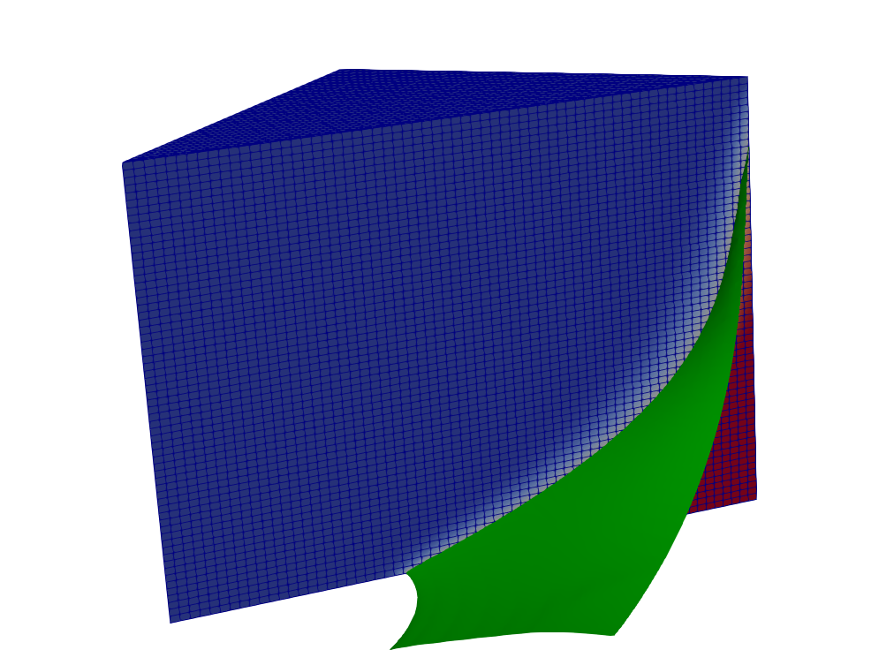
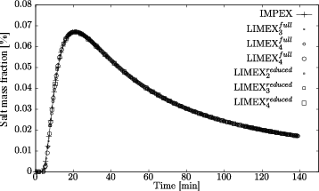

# Saltpool benchmark


## Description




## Example

```
ugshell -ex d3f_plusplus/saltpool/saltpool.lua --problem SALTPOOL3D
```

## References

1. Johannsen, K., Kinzelbach, W., Oswald, S. & Wittum, G. The saltpool benchmark problem - numerical simulation of saltwater upconing in a porous medium. Advances in Water Resources 25, 309–1708 (2002).

1. Oswald, S. E. & Kinzelbach, W. Three-dimensional physical benchmark experiments to test variable-density flow models. Journal of Hydrology 290 (2004) 290, 22–42 (2004).

